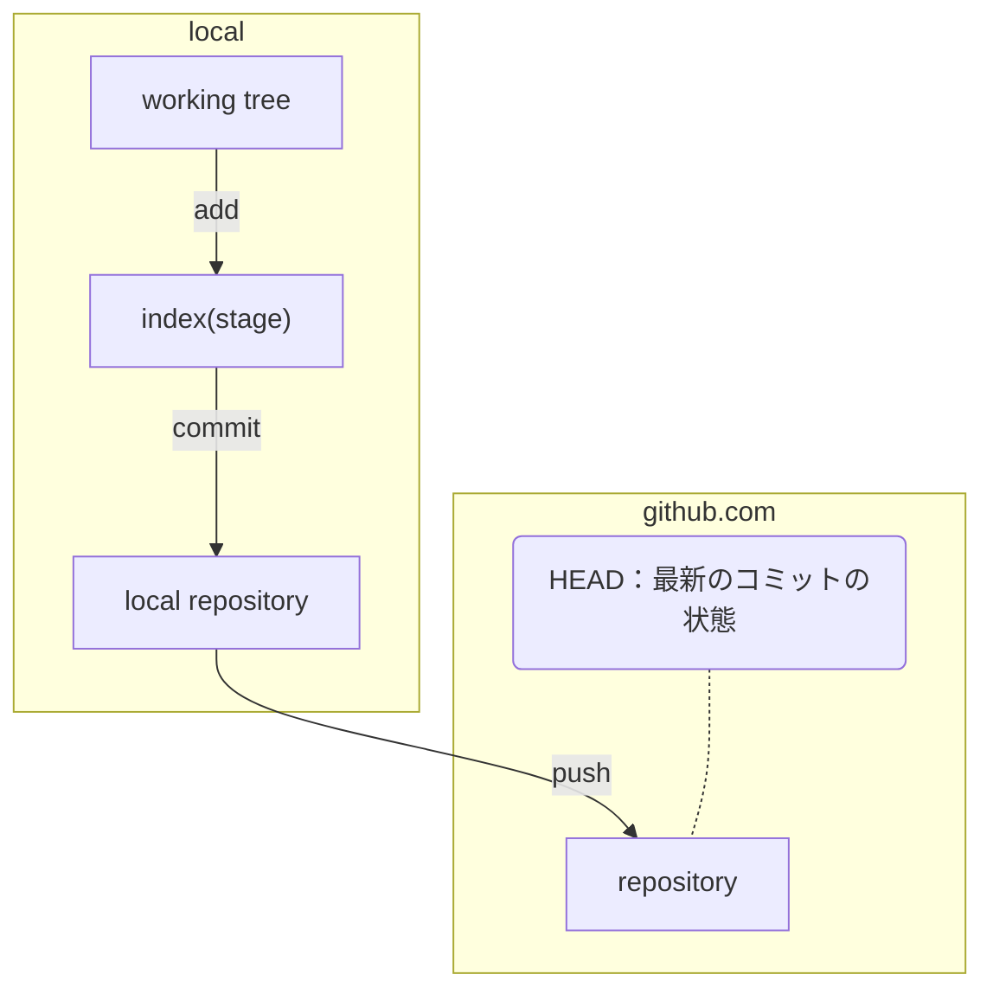

### Github basic




### Github CLI
1. window power shell - install github cli

`winget install --id GitHub.cli`

2. window power shell - authenticate github cli

`scoop install gh`

3. login

`gh auth login`

### vs code as code editor. 

possible to write git commit commandline in vscode rather than git bash terminal 

`git config --global core.editor "code --wait"`

>errors notes
>
>could not use the gh on the git bash due to the window terminal environment. It worked in window power shell.
> 
>・MinTTY: This is the default terminal emulator used by Git Bash on Windows.
>
>・Pseudo Terminal (PTY) Support: Many Unix-like operating systems use PTYs to handle interactive command-line input. MinTTY does not fully support this, which causes issues with tools like GitHub CLI that rely on interactive prompts.

# Repository Handling

1. window power shell - create repositoy

`gh repo create <<name>> --public --source=. --remote=origin`

2. Remove repository

- current directory linking with d

`rm -rf .git`

- remove the file only from repository but left the file in local directory.

`git rm --cached <filename>`

- remove repo

`gh repo delete xxxx/<repository>`


# Git initial setup

- Your Nameはgitでの作成者の名前になる

`git config --global user.name "Your Name"`

- 作成する人のEmail登録

`git config --global user.email "example@email.com"`


その後の一連の流れ
```
git init
git add . 
git commit -m "Initial commit"
git branch -M main
git push -u origin main
```

>-u または --set-upstream オプションを使用して、ローカルブランチとリモートブランチを関連付けます。このオプションを使用すると、以降は単に git push コマンドを入力するだけで、ローカルブランチの変更を対応するリモートブランチにプッシュできます。


`git remote add origin <url>`


### File & Directory Handling 

- create file

`touch <filename>`

 - remove file

`git rm <filename>`

- remove directory

`git rm -r <directory>`

- rename directory

`git mv <old> <nes>`


### Fetch the existing github repository
- Git connect to other project for co-work

`git clone <repository name>`

### Check
- show the blob object

`git has-object <object>`

`git log --oneline`

`git log -n 3`

`git log -p <filename省略可能>`

### Edit commit


### 変更を退避する

とあるブランチで作業中だけど、いますぐやりたいことができた。作業がすごく中途半端だからコミットはしたくない。

`git stash`
`git stash -u`

### Commit 関連修正

- amend current commit

`git commit --amend`

- revert commit

show my commit history

`git reflog`

revert the commit 

`git revert <commit HEAD>`